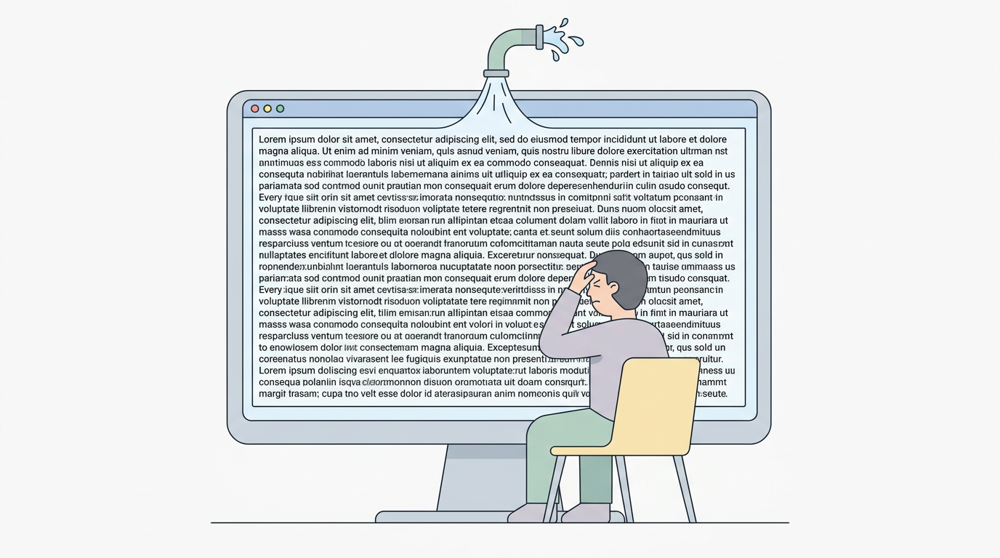
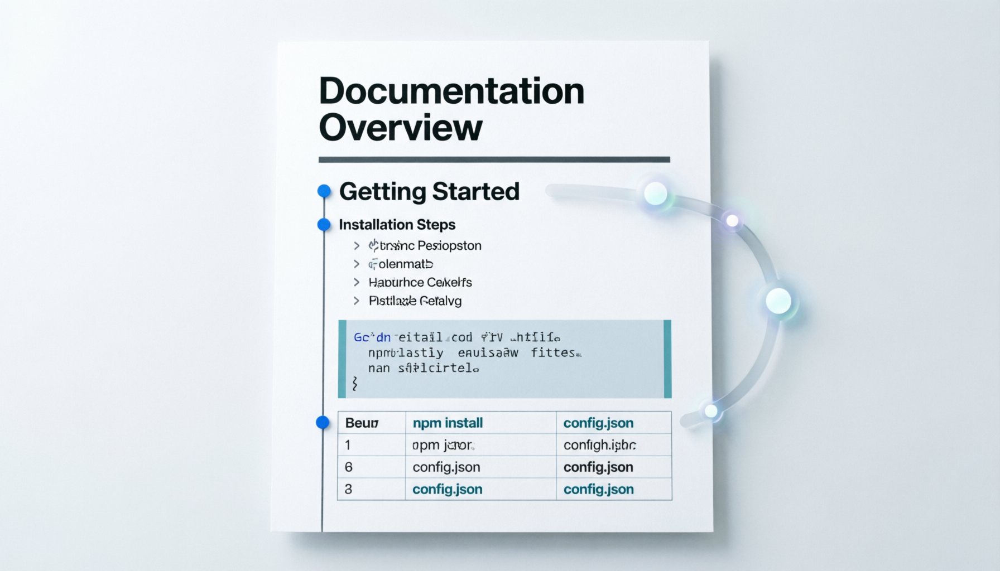
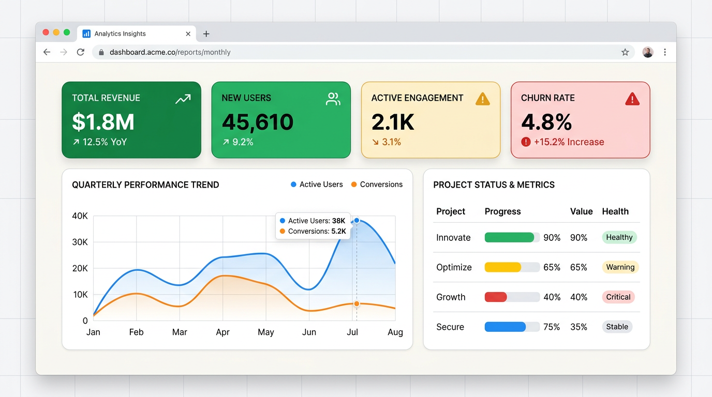
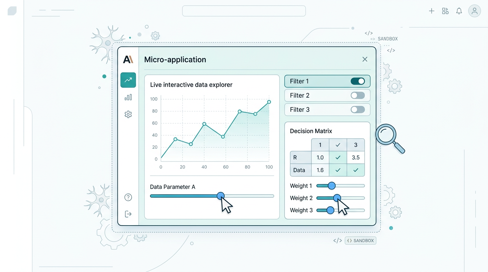
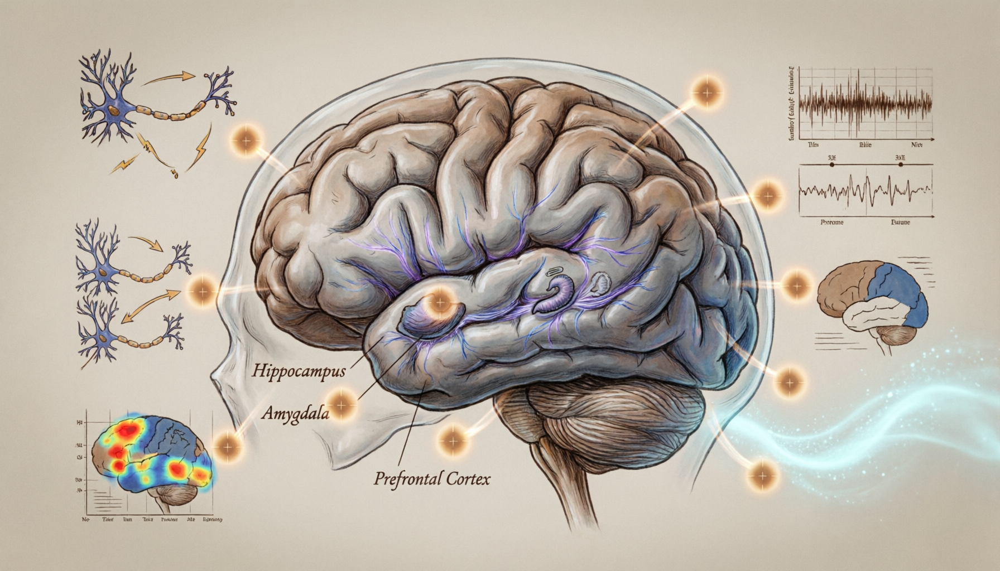

# AI 输出界面的范式演进：从文本流到神经界面

## 为什么界面在进化？一场人脑带宽的军备竞赛

AI 模型的能力在过去三年里增长了几个数量级。但有一个东西始终没变：人脑的处理速度。我们每分钟大约能读 250 个词，视觉反应时间约 100 毫秒，工作记忆一次只装得下 4-7 个信息块。

这构成了一个越来越尖锐的矛盾——AI 这边，一秒能生成上千 token 的信息；人这边，脑子还是老样子。**信息出得来，但人接不住。**

AI 输出界面的每一次进化，本质上都在回答同一个问题：**怎样让人脑有限的认知带宽，尽可能高效地接收 AI 的思考成果？**

或者换个角度说：不是让人变聪明，而是让输出变得更容易被人"秒懂"。

驱动这条演进线的力量有三重：

**第一，切换到更高带宽的感知通道。** 文字是一维线性的，人脑一次只能处理一行；视觉是二维并行的，一眼能扫完一整张图；交互是三维探索的，手一动就能验证一个假设。每一代范式都在往更宽的管道上切。

**第二，减少中间环节。** 从"AI 输出文字 → 人阅读 → 人在脑中建模 → 人做判断"，到"AI 直接渲染出人需要看到的东西 → 人直接感知 → 人做判断"。中间每少一层翻译，信息失真就少一层。

**第三，让人的决策节奏跟上 AI 的生成节奏。** AI 能秒级生成方案，但人需要分钟级去理解方案。解决办法不是催人快读，而是把方案"压缩"成人脑能瞬间吸收的形态——一张图、一个可拖拽的滑块、一帧动态画面。

---

## 演进全景

| 范式 | 名称 | 一句话 | 代表 | 时间 |
|------|------|--------|------|------|
| P0 | 纯文本流 | AI 逐字吐，人逐字读 | 早期 ChatGPT | 2020-2023 |
| P1 | 结构化标记 | 用格式标记线性展开信息层级 | ChatGPT/Claude Markdown 输出 | 2023-2024 |
| P2 | 声明式文档 | HTML/CSS 构建可直接交付的富视觉文档 | Claude Code HTML 输出 | 2024-2025 |
| P3 | 临时界面 | 生成一次性的交互微应用，辅助理解和决策 | Artifacts, Canvas, MCP Apps, A2UI | 2024-2025 |
| P4 | 像素流 | 模型直接输出像素帧，没有代码中介 | Flipbook | 2025- |
| P5 | 神经界面 | AI 即操作系统，渲染/状态/交互统一于一个模型 | NeuralOS（学术） | 理论阶段 |

下面逐一展开。结构是：每一代先说"它是什么"和"它长什么样"，然后说"它哪里不够用了"，自然引出下一代。

---

## 纯文本流——Raw Text



### 它是什么

AI 以最原始的方式输出内容：一个字一个字地往外蹦，没有标题、没有分段、没有加粗、没有任何视觉提示告诉你"这里是重点"或"这是一个列表"。

### 看起来什么样

假设你问 AI "介绍一下人脑的信息处理机制"，得到的是这样的回复：

```
The human brain processes information through approximately 86 billion neurons connected by trillions of synapses. Information flows through sensory neurons to the central nervous system where it is processed and integrated. The prefrontal cortex handles executive functions including decision making and planning. Working memory capacity is limited to approximately 4 to 7 chunks of information at any given time. Attention switching costs approximately 200 to 500 milliseconds per context switch...
```

一堵没有缝隙的文字墙。关键数字（860 亿、4-7 块）藏在句子中间，你得一行一行读才能找到。

### 它解决了什么

在 2020-2022 年的 GPT-3 时代，这已经是巨大的进步了——**机器第一次能用自然语言流畅地回答任何问题**。纯文本的优势是最大化的通用性：任何终端都能显示，任何程序都能解析，不依赖任何渲染引擎。

### 它哪里不够用了

问题出在**人脑被当成了格式化引擎**。面对 500 字的连续文本，你的大脑需要同时做两件事：一是理解内容本身（"神经元怎么工作"），二是整理结构（"哪些是重点""哪些是并列关系""哪些是先后步骤"）。后者消耗的认知资源，本来不应该由人来承担。

认知心理学的研究表明，人在扫描无格式文本时采用 F 形跳跃模式——只看前几行的开头部分。这意味着**大量信息被直接跳过了**。当 AI 有能力组织好信息再呈现时，为什么还要人自己来整理？

---

## 结构化标记——Markdown



### 它是什么

AI 用轻量标记语言（主要是 Markdown）给信息加上"脚手架"——标题区分层级，列表表达并列，代码块隔离代码，加粗标出重点。信息仍然是线性展开的，但有了可扫描的结构。

### 看起来什么样

同样的大脑信息，用 Markdown 输出：

```markdown
## 人脑信息处理机制

人脑通过约 **860 亿**神经元和数万亿突触来处理信息。

### 信息流路径
1. 感觉神经元接收外部刺激
2. 信号传入中枢神经系统
3. 前额叶皮层完成高级认知（决策、规划）

### 关键约束
- 工作记忆容量：**4-7 个信息块**
- 注意力切换成本：约 200-500ms
```

改变是立竿见影的：你可以先扫标题确定大纲，再深入感兴趣的段落。关键数字被加粗突出，步骤关系一目了然。

### 它解决了什么

**Markdown 把信息从"一维绳子"变成了"二维地图"。** 读者获得了非线性的信息获取能力——不需要从头读到尾，可以跳着看。对 AI 来说，Markdown 几乎是零成本的升级：训练语料里到处都是这种格式（GitHub、Stack Overflow、技术文档），模型天然就会。

### 它哪里不够用了

Markdown 本质上仍然是**只读文档**。三个场景暴露了它的天花板：

第一，**当你需要看一张趋势图时**。Markdown 只能给你一个数字表格，然后你得在脑中"渲染"成曲线。但数据可视化的全部意义就在于"让人不用在脑中渲染"。

第二，**当信息密度超过文本承载力时**。一个 20 行的对比表格，在 Markdown 中纵向占据大量空间，人眼无法一次扫完全部维度。而同样的信息如果用一张热力图呈现，一眼就能看出规律。

第三，**当概念本身是动态的**。状态机的变迁、数据的实时联动、流程的时序展开——这些信息在本质上是活的，硬压成静态文字必然丢失维度。

Anthropic 工程师 Thariq 的判断是："Markdown 正在走向表达力的尽头。当 AI 输出需要承载交互和视觉时，我们需要一个更宽敞的载体。"Google Chrome 团队的 Addy Osmani 更直接："Move from Markdown to HTML and give AI a richer canvas to express outputs."

---

## 声明式文档——HTML



### 它是什么

AI 输出一份完整的 HTML+CSS 文档，利用 Web 标准的全部视觉能力：多栏布局、SVG 图表、色彩编码、数据可视化、专业排版。产出物不是"需要进一步处理的半成品"，而是**"可以直接交付的视觉成品"**。

### 看起来什么样

你让 AI 做一份团队周报分析。Markdown 时代，你得到的是一堆文字和表格。HTML 时代，你得到的是这样的东西：

```html
<div class="dashboard">
  <div class="kpi-cards">
    <div class="card green">完成率 <strong>87%</strong> ↑12%</div>
    <div class="card yellow">延期任务 <strong>3</strong></div>
  </div>
  <svg class="trend-chart">
    <!-- 一条自动生成的折线图，展示过去8周趋势 -->
  </svg>
  <table class="priority-coded">
    <!-- 按优先级颜色编码的任务列表 -->
  </table>
</div>
```

打开浏览器就是一个有品牌色彩、数据图表、指标卡片的专业页面。可以直接转发给领导，不需要任何二次加工。

又比如，AI 帮你写一份技术方案 spec：架构图用 SVG 绘制，状态流转用颜色箭头标注，接口定义用美观的表格呈现——不再是 Markdown 表格那种歪歪扭扭的样子。

### 它解决了什么

HTML 的核心突破是**正式启用了人脑的视觉并行处理通道**。

Markdown 只利用了文本排版的有限视觉线索（缩进和加粗），本质上你还是在"读字"。HTML 打开了颜色、形状、位置、大小、对比度这些并行通道——人脑的视觉皮层能同时处理所有这些维度的信息，**信息吸收速度从"逐行阅读级"跳到"一眼扫视级"**。一个设计良好的数据仪表盘，信息密度可以是等量 Markdown 表格的 5-10 倍。

### 它哪里不够用了

HTML 文档无论多精美，本质上是**AI 预先替你决定了"你应该看什么"**。它是被动消费品——你看到的是 AI 认为重要的东西，按 AI 认为最好的方式排列。

但在很多场景下，你自己也不确定想看什么。"如果我把预算调低 20% 会怎样？""如果这个参数从 0.3 改成 0.7 呢？""如果把步骤 3 和步骤 4 调换呢？"——**这些"如果"类的问题，静态文档无法回应。** 你只能回到对话框重新提问，等 AI 重新生成一整份文档。

换句话说：当你的需求从"请告诉我答案"变成"请帮我探索可能性"时，只读文档就不够用了。你需要的不是一份完美的报告，而是一个可以动手摆弄的工具。

---

## 临时界面——Disposable Micro UI



### 它是什么

AI 生成一个即时可运行的交互式小应用——可能是一个 React 组件，可能是一段带 JavaScript 的 HTML 页面，甚至可能是一个 Three.js 3D 场景或 Canvas 动画——由平台在安全沙箱中即时渲染。

为什么叫"临时界面"？这里的"临时"不是说它用完必须删掉（事实上 Claude Artifacts 可以保存、分享链接、甚至 publish 为独立网页），而是指它的**价值模型**和传统软件截然不同：

- **传统软件**的价值与存续时间正相关——它需要持续维护、修 bug、升级依赖，停服就没价值了
- **临时界面**的价值在于它帮你达成理解的那个瞬间——生成成本趋近于零，重新生成的成本也趋近于零，不需要维护，过时了就再生成一个新的

更精确地说：**不是"用完必须丢掉"，而是"丢掉也不心疼"。** 就像便签纸上的 todo list——你可以贴在墙上留三天，但你不会为它建版本控制、不会花时间做视觉设计、丢了重写一张就好。它的价值在于帮你当下理清思路，不在于作为一个"产品"持续存在。

临时界面就是 AI 递给你的一张"活的草稿纸"——有人确实会把好用的 Artifact 收藏起来反复用（比如一个汇率计算器），但即使如此，它和传统 App 的区别仍然是：没有维护成本，随时可以让 AI 重新生成一个更好的版本。

### 看起来什么样

**场景一：数据探索。** 你说"帮我分析这份销售数据的季节性规律"。AI 不写一段 500 字的文字分析，而是弹出一个交互式图表——X 轴是时间，Y 轴是销售额，你可以拖动时间窗口、切换产品线、叠加去年同期对比。30 秒内，你用手而不是眼睛"看到了"规律。

**场景二：决策辅助。** 你说"我在纠结三个技术方案"。AI 弹出一个决策矩阵——每个评估维度都有一个权重滑块，你一边拖动一边看总分实时变化。不用看完 AI 写的三千字对比分析，拖几下就知道答案了。

**场景三：3D 可视化。** 你说"帮我理解这个分子结构"。AI 用 **Three.js** 生成一个可旋转、可缩放的 3D 分子模型——你可以用鼠标拖动旋转视角，点击原子查看属性。这种空间结构用文字描述需要几百字，用 3D 交互几秒就明白了。

**场景四：动态演示。** 你问"排序算法怎么工作"。AI 用 **Canvas** 渲染一个动画——柱状图实时交换位置，每一步高亮当前比较的元素，你可以拖动速度滑块控制演示节奏。

### 这一代的代表产品

**Claude Artifacts（Anthropic, 2024 年 6 月推出）**

Claude Artifacts 是临时界面范式的开创者，也是理解这个范式最好的入口。

它的工作方式是：当 AI 判断"这个回答用交互式界面比纯文字更好"时，会在对话窗口旁边打开一个独立的沙箱面板，实时渲染一段 AI 生成的代码（React 组件、HTML+JS 页面、SVG 图形等）。用户看到的不是代码，而是一个活的、可操作的界面。

**Artifacts 的关键设计决策：**

- **与对话并列而非替代对话。** 左边是 AI 的文字解释，右边是可操作的界面——两者互补。你可以一边看 AI 的说明，一边在 Artifact 中动手操作验证。
- **支持迭代。** 你可以对着渲染结果说"把这个图表改成柱状图""加一个时间筛选器"，AI 直接修改代码，界面实时更新。不需要重新描述整个需求。
- **沙箱隔离。** 生成的代码在受限环境中运行，不能访问网络、不能读写文件系统，确保安全。
- **可保存和分享。** 生成的 Artifact 可以收藏、通过链接分享给他人、甚至 publish 为独立网页。但正如前面所说——这不改变它"按需生成、不需维护"的本质。

**它的技术栈跨度很大。** 从简单的 HTML 表格到复杂的 Three.js 3D 场景，从 D3.js 数据可视化到 Canvas 物理模拟，只要是浏览器能运行的代码，Artifacts 都能渲染。这意味着 **Three.js、Canvas、WebGL、D3.js、GSAP 等 Web 交互技术都属于这个范式的"画笔"**——它们不是独立的演进层级，而是 AI 用来构建临时交互体验的工具集。

**ChatGPT Canvas（OpenAI, 2024 年 10 月推出）**

Canvas 的切入角度略有不同。它不是在对话旁边开一个"展示窗"，而是打开一个协作画布——AI 和用户可以在同一个空间内共同编辑文本或代码，像 Google Docs 那样实时看到对方的改动。更侧重"协同创作"而非"即时展示"。

**v0.dev（Vercel）**

走得更远：AI 生成完整的、可部署的前端组件。你描述想要什么样的页面，v0 直接给出可以复制到项目里的 React 代码和实时预览。介于"临时界面"和"正式产品开发工具"之间。

### 底层技术生态

这里补充说明：Canvas 2D（数据动画、粒子效果）、Three.js/WebGL（3D 模型、空间可视化）、D3.js（数据驱动图表）、GSAP（状态转换动画）——这些技术是临时界面的渲染能力来源。当 Claude 在 Artifacts 中输出一段 Three.js 代码渲染出一个可旋转的 3D 地球，或者用 Canvas 画出一个弹球物理模拟，本质上都是 P3 范式的具体实现。

### 走向标准化：MCP Apps 与 A2UI

当临时界面从"某一家产品的专属功能"变成行业共识，**标准化协议应运而生**。2025 年底，两个重要协议同时出现，代表了两条不同的技术路径：

**MCP Apps（Anthropic 主导）—— "在对话中弹出第三方应用"**

MCP Apps 的核心思想是：让任何第三方服务都能在 AI 对话中弹出自己的交互界面。技术机制是：MCP 服务器在响应时附带一个 `ui://` 资源地址，AI 客户端把这个地址加载到安全沙箱 iframe 中渲染，双方通过 JSON-RPC 实时通信。

**举例：** 你在 Claude 中说"帮我改一下 Slack 里那条消息的措辞"。接入 MCP Apps 的 Slack 服务直接在对话中弹出一个消息编辑器——你能看到原文、AI 修改后的版本、一个发送按钮。全程不用离开 AI 对话窗口，不用打开 Slack App。类似地，Figma 可以弹出设计稿预览让你直接批注，Asana 可以弹出任务卡片让你拖动排期。

**代码示例——MCP 服务端如何触发 UI：**

```javascript
// MCP 服务端：当 AI 调用 "edit_slack_message" 工具时，返回文本结果 + UI 地址
server.setRequestHandler(CallToolRequestSchema, async (request) => {
  if (request.params.name === "edit_slack_message") {
    return {
      content: [{ type: "text", text: "已打开 Slack 消息编辑器" }],
      // 关键：这行告诉客户端"请渲染这个 UI 资源"
      _meta: { ui: { resourceUri: "ui://slack-mcp/message-editor" } },
    };
  }
});

// 客户端请求该 URI 时，服务端返回 HTML 内容
server.setRequestHandler(ReadResourceRequestSchema, async (request) => {
  if (request.params.uri === "ui://slack-mcp/message-editor") {
    return {
      contents: [{
        uri: "ui://slack-mcp/message-editor",
        mimeType: "text/html;profile=mcp-app",  // 标识为 MCP App
        text: "<html>...</html>",  // 完整的编辑器 HTML/JS/CSS
      }],
    };
  }
});
```

```html
<!-- 渲染在沙箱 iframe 中的 UI，通过 postMessage 与宿主通信 -->
<div class="editor">
  <p class="original">原文：Hey team, the deadline is tomorrow</p>
  <textarea id="revised">Hi team, a friendly reminder that our deadline is tomorrow.</textarea>
  <button onclick="sendToChat()">发送修改后的消息</button>
</div>
<script>
  async function sendToChat() {
    const text = document.getElementById('revised').value;
    // 通过 JSON-RPC 把用户操作结果传回 AI 对话
    window.parent.postMessage({
      jsonrpc: '2.0', id: 1,
      method: 'ui/message',
      params: { content: { type: 'text', text: `用户确认发送：${text}` } }
    }, '*');
  }
</script>
```

核心流程是：**AI 调用工具 → 服务端返回 `_meta.ui.resourceUri` → 客户端加载该 URI 的 HTML 到沙箱 iframe → 用户在 iframe 中操作 → 操作结果通过 `postMessage` 回传到对话流。** 整个过程对用户来说就是"对话中弹出了一个小应用，用完自动收起"。

MCP Apps 本质上是把"临时界面"的能力**从单一平台开放给了整个 MCP 生态的第三方服务**。它的优势是灵活度高（服务端可渲染任意 HTML/JS），代价是依赖 Web 环境。

**A2UI（Google 主导）—— "AI 只说要什么，渲染交给本地"**

A2UI 走了完全不同的路：**AI 不输出任何代码，只输出一份"界面蓝图"。**

技术机制是：AI 返回一段声明式 JSON，描述"我想展示什么组件"（一个日期选择器、一个按钮、一张卡片），但完全不写渲染代码。客户端收到 JSON 后，用自己本地的组件库来画——iOS 上用 SwiftUI 组件，Android 上用 Material Design 组件，Web 上用 React 组件。

**举例：** 你对 AI 助手说"帮我订一张明天去上海的机票"。AI 返回的不是 HTML 页面，而是一段结构描述：

```json
{
  "type": "Form",
  "children": [
    { "type": "DatePicker", "label": "出发日期", "value": "2025-05-26" },
    { "type": "Select", "label": "舱位", "options": ["经济舱", "商务舱"] },
    { "type": "Button", "label": "搜索航班", "action": "search" }
  ]
}
```

在手机上它渲染成原生 Material Design 表单，在桌面上渲染成 Web 组件——同一份"意图描述"，每个平台都是原生体验。A2UI 的设计哲学是**"安全如数据，表达如代码"**——AI 不被允许执行任意代码，只能从预批准的组件目录中选择，杜绝了注入攻击。

**两者的关系：** MCP Apps 走"自由表达 + iframe 隔离"路线，A2UI 走"受限描述 + 原生渲染"路线。**它们的共同贡献是：让临时界面从个别产品的专属能力，变成了任何 AI Agent 都能调用的开放标准。**

### 它哪里不够用了

临时界面的底层仍然绑在**代码这根绳子上**。无论是 Artifacts 生成 React，MCP Apps 推送 HTML，还是 A2UI 描述 JSON 组件树——AI 的"想法"都必须先翻译为某种结构化描述，再由渲染引擎翻译为像素。

这带来三个根本约束：

**第一，表达力被组件库和框架限制。** 你想表达"一棵动态生长的思维导图，每个节点可以无限展开探索"？Web 组件没有这种原语。即使用 Three.js 或 Canvas，也必须用已有的 API 去搭建。能做的事是有限的。

**第二，交互路径是有限的。** 有人必须提前定义"用户可以做什么操作"——无论是开发者写代码，还是 A2UI 定义组件目录。**你不能点击一个没有事件监听器的区域，然后期待有意义的反馈。** 所有交互都是预设的，不是涌现的。

**第三，AI 的"创意"被实现细节吞噬。** 当一个复杂组件需要上千行代码时，AI 把大量"思考"花在了"怎么让代码跑对"上，而不是"怎么最好地呈现这个信息"。就像让画家不能直接画画，必须先写绘画指令文档让机器人执行——隔了一层翻译，表现力必然打折。

更深层的问题是：**临时界面还是"设计师思维"**——有人预判了"用户可能做什么操作"，然后提前实现。但真正自由的探索应该是"你在任何地方做任何动作，都能得到有意义的响应"——不需要任何人提前编程。

---

## 像素流——Pixel Stream (Flipbook)



### 它是什么

屏幕上的每一个像素，直接由 AI 模型输出。**没有 HTML，没有 CSS，没有布局引擎，没有前端代码，没有预设的按钮或链接**——你看到的一切就是一张模型"梦"出来的图像。你点击画面中的任何位置，模型通过语义理解推断你的意图，然后"梦"出下一张回应。形态上类似"交互式视频"。

### 看起来什么样

打开 Flipbook（flipbook.page），输入"quantum computing"。几秒后，屏幕上出现一张精心设计的量子计算信息图——不是网页渲染的 HTML，而是一张像海报一样的图像，有分区、有图示、有文字说明。

关键来了：你的鼠标移到"Qubit"这个区域，点击。模型理解了"这个人想深入量子比特"，几秒后整个屏幕变成一张全新的、专门关于 Qubit 的信息图。继续点击其中的"Superposition"，再深入一层。

**这是一本"永远翻不完的视觉百科"**——每一页都是 AI 根据你此刻的兴趣实时生成的。没有人提前画好这些页面，没有人定义好"点击 A 跳转到 B"的链接。模型即时理解你的意图，即时创造回应。


### 它解决了什么

像素流的根本突破是**砍掉了代码中介层**。

在前面所有范式中，AI 要呈现一个视觉概念，必须先把它"翻译"成代码或结构描述，再交给渲染引擎去画。像素流把这层翻译完全去掉——**AI 直接画出它想让你看到的东西**。

这带来三个质变：

**第一，交互从"预设"变为"涌现"。** 不再有"按钮"和"链接"这种预定义的交互元素。屏幕上的任何位置都是潜在的交互点——模型通过语义推断来决定"用户点这里想干嘛"，然后即时生成回应。交互能力不是代码写出来的，是理解力"长"出来的。

**第二，视觉表达没有天花板。** 不受 CSS 约束、不受组件库限制。模型可以用任何风格（手绘、3D、信息图、漫画、建筑图纸）来呈现信息，自由度和人类插画师一样。

**第三，探索是无限深度的。** 不存在"404 页面不存在"或"此功能暂不支持"。你可以无止境地追问和深入，模型总能生成下一层内容。

### 技术实现

Flipbook 由前 OpenAI 研究员 Zain Shah 开发。工作方式：图像生成模型渲染每一帧静态画面；Lightricks 的 LTX Studio 视频模型负责动画过渡；画面通过 WebSocket 以 1080p 24fps 流式推送到浏览器；后端跑在 Modal Labs 的无服务器 GPU 集群上。

Shah 坦承一个关键事实：因为完全符合这种"交互式视觉百科"需求的训练数据几乎不存在，**当前方案是把图像模型和视频模型暴力拼接**。这不是优雅的端到端方案，而是"先把概念跑通"的原型。

### 它哪里不够用了

像素流目前面临的问题不是方向性的，而是工程成熟度的：

**延迟是致命的。** 每次点击要等 1-2 分钟才出下一帧，而人对交互响应的耐受阈值是 100-200 毫秒。**差距是三个数量级**——相当于拨号上网和光纤的区别。

**文字渲染不可靠。** 图像生成模型天生对文字敏感——经常拼错字、字形扭曲、排版混乱。对需要精确文字的场景（代码、数据表格、法律条文），完全不可用。

**没有状态记忆。** 每一帧独立生成，模型不记得"之前发生了什么"。NeuralOS 论文显示，超过 256 帧后，模型的状态追踪能力显著退化。

**经济学不成立。** 渲染一帧需要一次完整的 GPU 推理；传统渲染一个按钮只需几字节 CSS。计算成本差六七个数量级。

**信息可能是假的。** 生成的视觉内容没有外部事实校验，准确度和 ChatGPT 的幻觉水平大致相当。

**Flipbook 之于成熟的像素流界面，相当于 1903 年莱特兄弟的飞行器之于波音 747：方向毫无疑问是对的，但距离日常可用还有很长的工程积累。**

---

## 神经界面——Neural Surface


### 它是什么

一个统一的神经网络，同时扮演 CPU（推理）、GPU（渲染）、RAM（状态记忆）和 OS（进程调度）。不再有"模型生成帧 + 前端显示帧"的分离架构——**整个"计算机"就是一个端到端的神经网络**。用户的每次输入被编码为向量，模型在潜空间中"计算"后，直接解码为下一帧屏幕像素。

界面不是"被生成的"——**界面是模型内在状态的外在投影**。

### 看起来什么样（理论推演）

想象打开一台"神经计算机"。没有桌面图标、没有任务栏、没有固定菜单。屏幕呈现的是模型根据你当下状态和意图"想象"出来的界面。

你说"我要做一份季度汇报"，屏幕自然流变为适合报告编辑的形态——不是任何现有 App 的样子，而是模型认为最适合你此刻任务的独特布局。你开始操作数据，界面自动涌现出辅助工具。切换任务时，整个界面像水一样重塑为新形态，没有"切换 App"的概念。

### 它要解决什么

像素流（P4）的核心缺陷是**"无状态"**——每一帧独立生成，没有跨时间的连续记忆。Neural Surface 要让像素流"活过来"：不仅生成每一帧的外观，还维持一个持续演化的内部世界。

### 当前进展

纯学术阶段。NeuralOS（arXiv 2507.08800）用 RNN 做状态追踪 + 扩散渲染器做帧输出，在简单 GUI 操作（打开文件管理器、点击菜单）上实现了 <2px 的光标误差。但复杂键盘输入会出错，超过 256 帧后记忆退化。

距离实用至少还需要：长期记忆能力突破、推理速度 3-4 个数量级的提升、全新的训练范式。Karpathy 将这称为 Software 3.0 的终极形态——但也承认"we're in the very early innings"。

---

## 贯穿始终的结构性规律

### 每一代解的是同一道题的不同层面

核心矛盾始终是：AI 的输出能力越来越强，人的接收带宽纹丝不动。每一代范式都是一种新的"适配器"：

- P0 → P1（纯文本 → Markdown）：**降低扫描成本**，解决"找不到重点"
- P1 → P2（Markdown → HTML）：**激活视觉并行通道**，解决"想象不出来"
- P2 → P3（HTML → 临时界面）：**让人主动探索而非被动接受**，解决"信息过载但不知该看哪里"
- P3 → P4（临时界面 → 像素流）：**消除代码到像素的翻译损耗**，解决"表达力被框架限死"
- P4 → P5（像素流 → 神经界面）：**加入持续状态和记忆**，解决"每次交互都从头开始"

### 演进是共存，不是替代

高范式不会消灭低范式，而是把低范式推入特定生态位。正如视频没消灭文字，电话没消灭邮件：

- **Markdown** 退守"精确文本"位——代码审查、技术规范、版本控制中的协作
- **HTML 文档** 退守"正式交付"位——邮件报告、对外分享的成品文档
- **临时界面** 占据"探索性思考"位——数据分析、方案比选、原型验证
- **像素流** 占据"沉浸式消费"位——概念教育、创意灵感、视觉探索
- **神经界面** 如果实现，将占据"持续工作环境"位——替代操作系统本身

### 临时界面的独特哲学定位

在整条演进链中，P3（临时界面）有一个独特的性质：**它是唯一一个不以"持续存在"为价值前提的范式。**

Markdown 文档会被存档和引用，HTML 报告会被转发和审批，像素流帧代表着一次完整的视觉体验——它们的价值都依附于"产出物本身"。但临时界面的价值模型不同：它的核心价值在于**加速了人类到达判断的过程**，而非那个界面本身。

这并不意味着 Artifact 一定会被丢弃——Claude Artifacts 可以保存、分享、甚至发布为独立页面，有人会把好用的工具型 Artifact 反复使用。但定义这个范式的关键特征是：

- **生成成本趋近于零**——不需要产品经理、设计师、工程师的协作链
- **重新生成的成本也趋近于零**——过时了、不够好了，让 AI 重新做一个就行
- **不需要维护**——没有依赖要升级、没有 bug 要修、没有兼容性要保障
- **价值不随时间积累**——一个帮你做完决策的交互图表，决策做完后它的边际价值就趋近于零了

这揭示了一个深层规律：在很多场景下，人需要的不是"一份输出物"，而是"一次理解过程的加速"。**临时界面是 AI 递给人的一副"认知假肢"**——临时放大你对某个问题的理解力，帮你更快到达判断，然后功成身退。保存它是可以的，但保存与否不影响它已经完成的使命。

### 代码不会消失，它会退入后台

Flipbook 的支持者暗示"传统软件开发可能变成历史"。但更审慎的判断是：**像素是不可编辑的终态，代码是可审计、可协作的中间态。** 在精确性场景（金融、医疗）、协作场景（需要 diff/merge）、可访问性场景（屏幕阅读器、SEO），结构化代码仍然不可替代。

更可能的未来是分层共存——像素流和神经界面用于终端消费体验，代码和标记继续作为生产协作的"源码"。正如视频的盛行没有消灭剧本。

---

## 我们现在站在哪里

2025 年中，行业处于 P1 到 P3 的混合过渡期。Markdown 仍是大多数 AI 产品的默认格式；HTML 输出被先锋团队（Claude Code）开始推广；临时界面（Artifacts/Canvas）已成为主流 AI 产品标配，MCP Apps 和 A2UI 正在将其标准化为开放协议；Flipbook 以一个激动人心但远不成熟的原型出现在地平线上。

**这条线的终点是 AI 的"思考"与人类的"感知"之间距离趋近于零。** 目前距离还很远——但方向已经清晰：不是让人去适应 AI 的输出格式，而是让 AI 的输出去适配人脑的工作方式。

每一代范式，都是在这条路上踩下的一个脚印。

---

*参考：Karpathy Software 3.0 (AI Startup School 2025)、NeuralOS (arXiv 2507.08800)、Flipbook (flipbook.page, Zain Shah)、Thariq Shihipar & Addy Osmani "HTML > Markdown" 讨论、MCP Apps 官方博客 (blog.modelcontextprotocol.io)、Google A2UI (a2ui.org)、Claude Artifacts & ChatGPT Canvas 产品分析*
